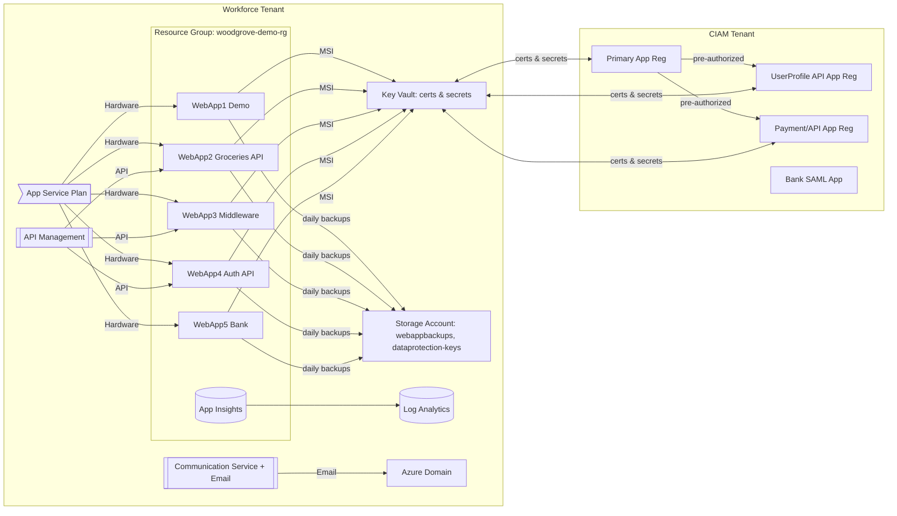

# 3Cloud Infrastructure (CIAM Demo)

End-to-end Terraform for a Woodgrove-style demo environment spanning **Azure CIAM (External ID) app registrations**, **Azure AD (workforce) integration**, **Key Vault + certs/secrets**, **Storage + SAS rotation**, **App Service (5 web apps)**, **API Management**, **Azure Communication Services (Email)**, **Application Insights**, and **Log Analytics**.

> **Tenants:**
> - **Workforce tenant & subscription** — hosts Azure resources (RG, KV, Storage, APIM, ACS, App Service, Log Analytics/App Insights).
> - **CIAM tenant** — hosts app registrations (Primary, UserProfile API, Payment/API), SAML Bank enterprise app, permissions & pre-authorizations.

## Architecture


## What this deploys
`**NOTE** : this is a demo environment. Do not use in production without reviewing and adjusting settings (SKU, scaling, security, networking, etc).`
`The package requires **Two tenants**: workforce (Azure resources) and CIAM (app registrations, SAML app, permissions).`
`**All resources** (below) are created in a single region (default: US Central). Modify variables.tf to change.`

- **Workforce Resources** in a single Resource Group assigned to a single region:
  - Default location: `centralus` (Modify `variables.tf` to change.).
  - **Resource Group** - `woodgrove-demo-rg` (default; Modify `variables.tf` to change.).
  - **Storage account** + containers (`webappbackups`, `dataprotection-keys`), **SAS generation** & **rotation** (via `time_rotating`) with the SAS string stored in **Key Vault**.
  - **Key Vault** with certificates and secrets:
    - **certificates**: Self-Signed Certificiates create for (Primary/Profile/App) 
    - Access for admins, 
    - Access for Azure Bankend Service (Requires Policy)
    - Each web app has a menaged identity with access to read certs/secrets.
    - **Secrets Information**:
      - app client secrets
      - certificate securets (Base64 PFX)
      - rotated SAS token - This token is rotated based on the `rotation_interval_hours` variable.
  - **App Service Plan** (Windows) and **Five Windows Web Apps** 
    - All are plumbed with Auth v2 (optional)
    - Each WebApp is configured with a Managed Service Identity (MSI)
    - Each WebApp is Using .NET stack 9
    - Each WebApp is configured with App Insights and Log Aanalytics Workspace
    - Key Vault policies are configured for Each Web App to access stored secrets and certificates via Key Vault Access Policies.
  - **ARM-based backup configuration** for each Web Application (daily, 30-day retention) using the rotated SAS string.
  - **APIM** with system-assigned identity and a placeholder API (replace with your own).
  - **Communication Services (Email)** with Azure-managed domain association.

- **CIAM Resources** 
    - 3 Application registrations 
        - Primary app (web + API; authN/authZ)
        - Application API (protected API; authZ)
        - UserProfile API (protected API; authZ)
        - Each App Registration (above) has one secret stored in Workforce Keyvault
        - Public Certificates (generated from the self signed certificates) are uploaded to CIAM App Registrations via Az CLI.
    - 1 SAML enterprise app with pre-authorized scopes; 

## Prerequisites
- **Terraform** 1.5+ and Azure CLI.
- Permissions:
  - Workforce subscription: ability to create RG, KV, Storage, APIM, ACS, App Service, LAW/AI, and role assignments.
  - CIAM tenant: ability to create **app registrations**, service principals, permissions/pre-auth, and **add credentials**.
- For cert upload: host running `az` with service principals for **both** tenants.
- A Windows host with PowerShell for the certificate upload process.

## Configure providers
`provider.tf` pins: `azurerm ~> 4.x`, `azuread >= 2.7`, and `random ~> 3.6`. Two Azure AD providers are configured: default points to **CIAM** (client credentials), alias `workforce` points to the **workforce** tenant. Update `variables.tf` (tenant/subscription/client IDs & secrets) and, preferably, source secrets from your CI/CD system.

## Variables
All variables live in `variables.tf`. Minimal overrides go in `terraform.tfvars` (or environment-specific tfvars). Key settings:
- `ext_*` and `work_*` for tenant/subscription and identities.
- `rg_*`, `kv_*`, `storage_*`, `la`, `appinsights` for platform.
- `asp_*`, `webapp*`, `site*`, `cert*` App Service Plan, WebApp Settings, WebSite Settings, and certs.
- `rotation_interval_hours` for SAS rotation.

## Quick start
```bash
# 1) Login to the workforce subscription
az login
az account set --subscription <WORK_SUBSCRIPTION_ID>

or

# 1) Login to the CIAM subscription
az login
az account set --subscription <CIAM_SUBSCRIPTION_ID> --allow-no-subscriptions  //Subscriptions are not supported in Azure CIAM tenants.

# 2) Initialize and preview
terraform init
terraform plan -var-file="terraform.tfvars"

# 3) Apply
terraform apply -var-file="terraform.tfvars"
```
After apply, inspect the `output.tf` values for app IDs, consent URLs, SAML info, and important endpoints.

## Post-deploy steps
- **APIM**: replace the Petstore OpenAPI with your API, add JWT validation policies against CIAM, and configure per-API settings.
- **SAML (Bank)**: set **Entity ID** and **Reply URL** in the Enterprise App to match the WebApp5 URLs from outputs.
- **Authorize API(s)**: in CIAM, authorize the Primary app, UserProfile app and the Application app(s) for GraphAPI Permissions.  **Note**: The permissions are added in Terraform but still require admin consent.  **IMPORTANT**: Use both URLS from outputs to complete this step and modify the scopes as needed.
- **User flows (CIAM)**: create sign-up/sign-in and profile manually and add the created Applications to it.  
  - **FUTURE**: Currently Microsoft does not support the automated creation of a User Flow in a CIAM Tenant.  
    - They do however support a creation of a User Flow in a Workforce Tenant.  
    - I wrote the following powershell to create / edit the a user flow(s) once supported by Microsoft. (see `scripts/userflow.ps1` for future automation).
- Configure the Application Settings in each Web App as needed (some are pre-configured).
    - Source Code for 3Cloud CIAM Demo: https://github.com/t79homasdw/woodgrove
    - Source Code for Groceries API: https://github.com/t79homasdw/groceries-auth
    - Source Code for Middleware: https://github.com/t79homasdw/woodgrove-middleware
    - Source Code for Auth API: https://github.com/t79homasdw/groceries-auth
    - Source Code for 3Cloud Bank: https://github.com/t79homasdw/woodgrove-bank

## Security notes
- **Key Vault RBAC vs Access Policies**: The repo defines both policies and RBAC permissions. 
  - **NOTE** if `kv_enable_rbac_authorization = true`, this will disable access policy resources via conditional `count`. 
  - If you prefer access policies, set RBAC to `false` you will be able to use both.
  - **To Automate Deploying Certificates** this setting is required `kv_enable_rbac_authorization = false` currently Microsoft only supports adding certs via Key Vault access policies for the process of creating and sharing certificates. If you want to use RBAC only, you must upload certs manually.
- **Secrets**: 3Cloud prefers to use **certificates** over client secrets for app creds. 
  - Where secrets are used, set short expiry and alerts.
- **Identity in CI/CD**: use **federated OIDC** for GitHub/Azure DevOps instead of storing client secrets.

## Troubleshooting
- If the web apps can’t read the selft signed certificates verify the following:
  - The **App Service RP** access policy in Key Vault includes `get` and `list` for certificates.
  - The **WEBSITE_LOAD_CERTIFICATES** setting is set to `*` or the thumbprint of the certificate.
  - the **WEBSITE_LOAD_USER_PROFILE** setting is set to `1`.
- If a web application backup fails, 
  - Confirm the **SAS secret** in the Key Vault is valid
  - Confirm the logic deployed properly rotated the key
  - Also check the Storage RBAC permissions for each web app.
- For CIAM certificate uploads
  - verify both tenant logins and `az ad app credential reset --cert` permissions.  
    - **Note**: this requires a Windows host with PowerShell 5.1.  
    - Linux, MacOS, and Powershell 6.x and higher are not supported for this step.
 
## Contributing
- PRs welcome
    - Please run `terraform fmt` 
    - Please ensure plans are clean 
    - Please keep your provider version pinned.

## Happy to discuss new features and improvements via Issues.
---

### Appendix: Files
See **CODEBASE-INVENTORY.md** for a full per-file description.
